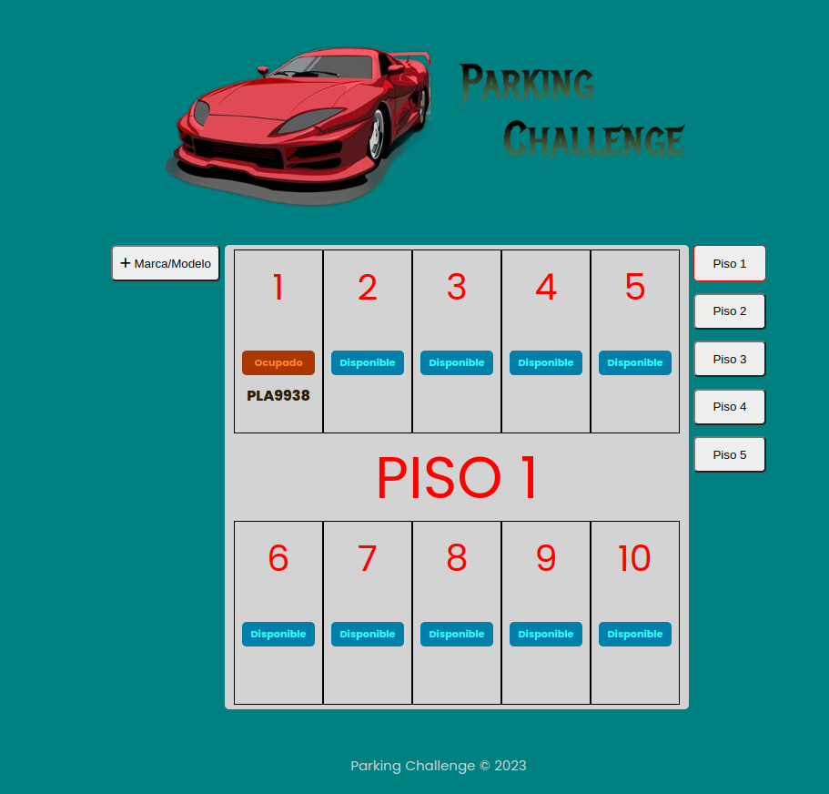
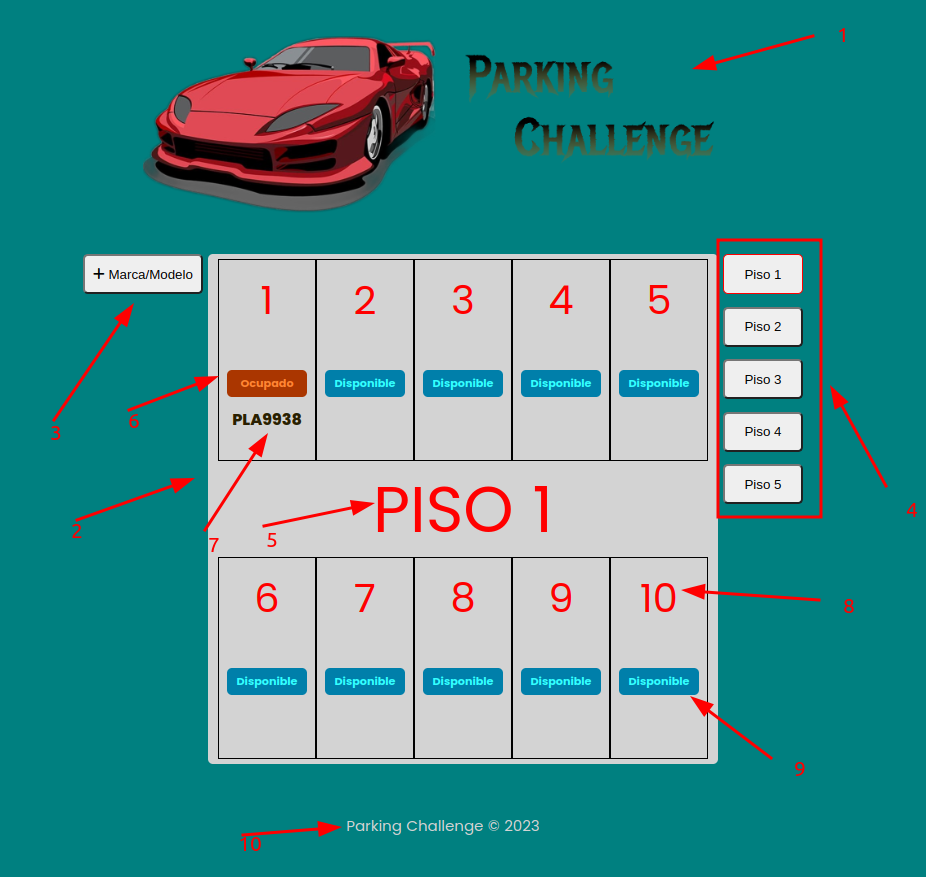
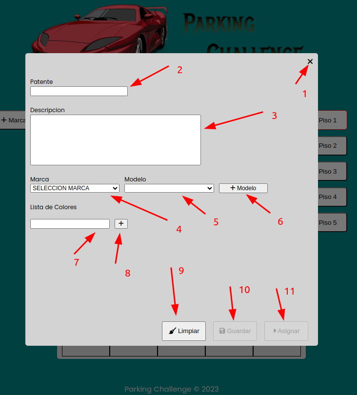
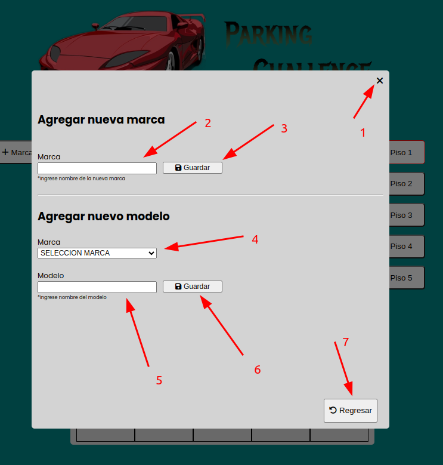

# PARKING CHALLENGE

*figura 1*

Sistema de control de estacionamiento, realizado en PHP, MySQL, HTML, JavaScript y CSS. El sistema no cuenta con la implementacion de ningun *framework* es vanilla desde el *backend* hasta el *frontend*. Está orientado a una arquitectura *API REST* por el cual no fue disenado bajo *MVC* (Modelo Vista Controlador). 

### Detalles en el Frontend
Previamente mencionado en el *frontend* no tiene *framework* alguno, esto explica la implementación usada. Este cuenta de un archivo HTML, uno JavaScript y un CSS.

##### HTML:
En el archivo HTML está contenido todo el maquetado sin estilos o código de ejecución fuera de identificadores y eventos respectivos.

##### JavaScript:
Se implementó un modelo funcional para gestionar eventos, cargas de datos y actualización de la vista (salvando las distancias se buscó un enfoque dinámico evitando recargas).

##### CSS:
Archivo de estilos.

##### Diseño:
El diseño es minimalista debido a su naturaleza sin *frameworks* y tiempo de desarrollo. La paleta de colores y formas de los componentes visuales está inspirado en versiones antiguas del windows 95/98, ya que en el proceso de desarrollo viendo las tecnologías que se están utilizando (en este proyecto) y lo que hoy en día es el desarrollo de software (y más aún desarrollo web) se siente un poco arcaico pro decirlo de algún modo (opinión personal del desarrollador).

### Detalles en el Backend
Se adoptó una arquitectura estructurada y dividida en *controllers* y *lib*. Donde los *controllers* reciben el requerimiento desde la vista (GET, POST, PUT) y también es encargado de imprimir el resultado de dicha consulta. Por otro lado, *lib* está manejado en clases y en estas clases cada método contiene la lógica e intervención en base de datos.

### Instalación y puesta en marcha

#### Migración de base de datos
En la carpeta *database* está la semilla inicial con el modelo y datos iniciales, asegúrese de crear un usuario con los permisos adecuados (CRUD) para interactuar con la aplicación.

#### Variables de entorno
Consta principalmente de cuatro variables que son consultadas en el archivo *app/lib/conn.php* si existe algún inconveniente, remplace la implantación del archivo *.env* con los valores absolutos (esto en ambiente local, no lo haga en ambientes productivos). Variables:
- DB_HOST=*host de la base de datos (ejemplo: localhost)*
- DB_USERNAME=*nombre de usuario en base de datos (ejemplo: usuario1)*
- DB_PASSWORD=*contraseña asociada a ese usuario*
- DB_NAME=*nombre de la base de datos (ejemplo: parking challenge)*

#### Implementar el backend
Inicialmente, se debe copiar la carpeta *app* y pegarla en la carpeta destino del gestor de servidor MAMP, XAMP o LAMP. **Importante** que se mantenga la carpeta *app*, ya que las rutas del *frontend* están apuntando a */app/...*.

## Uso de la interfaz del sistema

### Partes y usabilidad del dashboard

*figura 2*

- 1. Banner.
- 2. Vista virtual del piso de estacionamiento.
- 3. Botón para desplegar el formulario donde se agregan nuevas marcas y modelos (*figura 4*).
- 4. Juego de botones donde se selecciona cada piso del estacionamiento y ser visualizado.
- 5. Texto donde indica que piso se está visualizando.
- 6. Botón que indica que el espacio está ocupado. Al pulsarlo despliega un alerta preguntando si está seguro de liberar el espacio.
- 7. Texto donde se muestra la patente/matrícula del vehículo que ocupa el estacionamiento.
- 8. Texto que indica la numeración de cada puesto.
- 9. Botón que indica que el puesto está disponible. Al pulsarlo despliega el formulario de ingreso del vehículo (*figura 3*).
- 10. Footer.

### Partes y usabilidad del formulario de ingreso/asignación del puesto de estacionamiento

*figura 3*

- 1. Botón para cerrar el modal.
- 2. Entrada de patente/matrícula. Al ingresarla presionar *Enter* si existe el registro se cargan los datos en los demás campos, de lo contrario se quedan en blanco (la matrícula consta de siete dígitos alfanuméricos).
- 3. Entrada de una descripción sobre el vehículo es de libre ingreso.
- 4. Selección de marca del vehículo, este campo carga la lista de modelos asociada a esa marca.
- 5. Previa selección de la marca se selecciona el modelo.
- 6. Botón que despliega el formulario, ingreso de la nueva marca o modelo (*figura 4 *).
- 7. Entrada de texto de los colores observados en el vehículo.
- 8. Previo ingreso en la entrada de color (7) al hacer clic en el botón, este consolida el dato, por cada color en la lista.
- 9. Botón para limpiar y hacer reinicio del formulario.
- 10. Cuando el automóvil no está registrado se completa los campos y se hace clic guardando la data de dicho automóvil. Por contra parte, si el automóvil está registrado y se desea editar alguno de sus datos (menos la patente/matrícula), se cambia el dato y se hace clic en dicho botón.
- 11. Cuando se ha completado el proceso se hace clic sobre ese botón guardando la asignación del puesto a ese automóvil.

**Nota:** El puesto de estacionamiento y su respectivo piso ya está implícito cuando se presiona el botón disponible/asignar en dicho puesto.

### Partes y usabilidad del formulario de ingreso de marca o modelo

*figura 4*

- 1. Botón para cerrar el modal.
- 2. Entrada de texto del nombre de la marca.
- 3. Botón de guardado de la nueva marca.
- 4. Selección de la marca al que se va a asociar el nuevo modelo.
- 5. Entrada de texto del nombre del modelo.
- 6. Botón de guardado del nuevo modelo.
- 7. Botón de regreso al formulario de ingreso/asignación (*figura 3*). **Nota** este botón solo es visible si has presionado el botón "+ modelo" *figura 3* número 6. Caso contrario si se viene del botón "+ Marca/Modelo" *figura 2* número 3 no está disponible.

## Por Hacer…

- Manejo de errores.
- Alertas tanto de aciertos en el proceso como errores.
- Validaciones en los campos.
- Validación de campo completado previo envió de la información.
- Validaciones varias en el backend.

## Desarrollo

Se utilizaron diferentes tecnologías para completar hasta esta fase en el desarrollo de este sistema. El ambiente se levantó con docker y docker-compose, como gestor de tareas se usó Make y como editor de texto vscode. Todo esto corriendo en una máquina con sistema operativo Ubuntu 22.04.3 LTS.
